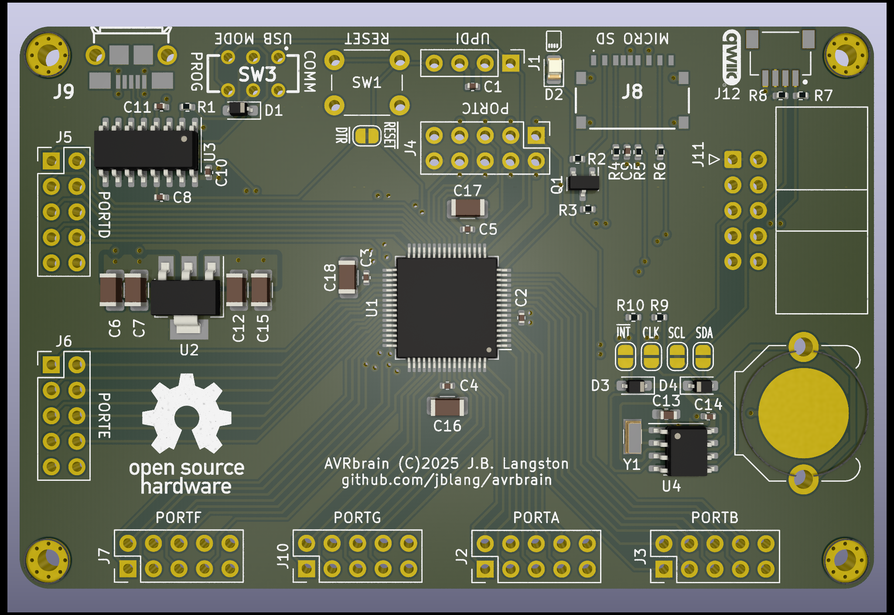

# AVRBrain

AVRbrain is an [AVR128DB64](https://www.microchip.com/en-us/product/avr128db64) dev board.  The AVR Dx series are modern AVRs with many desireable features over the classic ATmega AVRs, such as multi-voltage I/O, configurable logic, advanced analog features, and a single-wire programming and debug interface.



## Arduino Compatibility

AVRbrain is compatible with the [DxCore](https://github.com/SpenceKonde/DxCore) Arduino Core. I have tested the AVR128DB28 on a breadboard with the same programming circuit I intend to use on the finished board, and confirmed that it works.

Once flashed in UPDI programming mode, the Optiboot_Dx bootloader can be used to reprogram the board in serial comms mode, and there is an auto-reset circuit connected to the DTR line (possible to disable with a jumper).

## PlatformIO Compatibility

AVRbrain is compatible with [PlatformIO](https://platformio.org/) using the [Atmel megaAVR platform](https://docs.platformio.org/en/latest/platforms/atmelmegaavr.html).  PlatformIO supports Arduino development using DxCore, or native development using [avr-libc](https://www.nongnu.org/avr-libc/).  

Here's the `platformio.ini` that I used to build a simple non-Arduino led blinking example for the AVR128DB64:
```
[env:AVR128DB28]
platform = atmelmegaavr
platform_packages = platformio/toolchain-atmelavr@^3.70300.220127
board = AVR128DB28
upload_speed = 115200
upload_flags = 
    --tool
    uart
    --device
    avr128db28
    --uart
    $UPLOAD_PORT
    --clk
    $UPLOAD_SPEED
upload_command = pymcuprog write --erase $UPLOAD_FLAGS --filename $SOURCE
```

The above example can be made to work with DxCore just by adding the line `framework = arduino` to this file.

## Hardware Features
- Onboard CH340C USB-to-serial converter with a micro-USB connector, and a switch to select between USB communication or programming via SerialUPDI.  
- Onboard 3.3V regulator for MVIO. The board is configured to have 3.3V on PORTC and 5V on the other ports, but this can be swapped, or the board can be made to use a single voltage by cutting some traces and adding solder bridges on the appropriate jumper pads.
- SD card holder connected to 3.3V SPI Bus, and an I2C RTC (PCF8563T) with battery backup via CR 1612 coin cell.
- [UEXT port](https://www.olimex.com/Products/Modules/) that exports 3.3V UART, I2C, and SPI buses.  Many peripheral modules are available from Olimex.
- [Qwiic I2C port](https://www.sparkfun.com/qwiic) to work with the Qwiic and Stemma QT ecosystems. Many peripheral modules are available from Sparkfun and Adafruit.
- Headers breaking out 6 8-bit ports (ports A-E and G). Pin sockets can be used for stackable shield-style add-on boards, or pin headers can be used to connect to breadboards or elsewhere using IDC cables. Every signal has its own ground return opposite, so it should be possible to maintain pretty good signal integrity over IDC.
- Port F is used for the USB UART, SD card chip select (level shifted), RTC interrupt, 32 kHz clock signals, and of course UPDI and Reset.
- All of the RTC signals (including I2C) can be disconnected by cutting the traces in the jumper pads, and this can be undone by adding a solder bridge.
- UPDI header for use with a [PicKit](https://www.microchip.com/en-us/development-tool/pg164150) and [MPLAB X](https://www.microchip.com/en-us/tools-resources/develop/mplab-x-ide) for debugging.
- Same size as a Raspberry Pi Model B. However, it is not mechanically or electrically compatible.  The right-side mounting holes are on the corners though instead of toward the middle of the board, and no attempt has been made to reproduce the GPIO header pinout used on the Pi.
- The board is two layer, but I've tried hard to maintain a good ground plane.

## Relationship to z80ctrl NG

[z80ctrl NG](https://github.com/jblang/z80ctrl/tree/master/hardware/nextgen) is the next-generation z80ctrl board I am designing concurrently with AVRbrain.  It uses all the same hardware components, including the AVR128DB64, the USB chip, RTC, voltage regulator, sd card slot, etc.  The primary difference is the pinout. The z80ctrl NG is intended to interface with the [RCBus](https://smallcomputercentral.com/rcbus/) parallel bus used primarily by Z80-based retrocomputers, whereas AVRbrain is intended as a general-purpose dev board with stacking shield-style modules or IDC cables.  z80ctrl also includes a 512K SRAM chip with optional banking that can be initialized by the AVR and then used by the 8-bit processor that z80ctrl shares a bus with.
